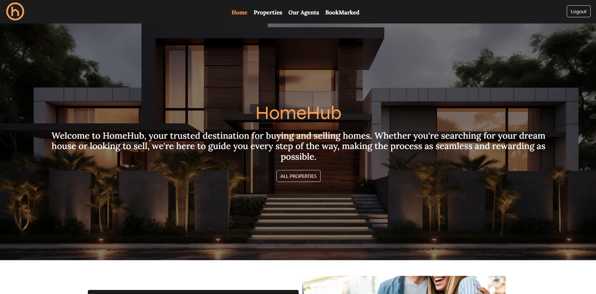

# Real Estate Web Application

This Real Estate Web Application is a dynamic platform that allows users to browse, bookmark, and purchase properties. Agents can list new properties, and administrators can manage property approvals. The application also includes features like a mortgage calculator and reviews for properties.

## Table of Contents

1. [Features](#features)
2. [UI Design](#ui-design)
3. [Installation](#installation)
4. [MockUps](#mockups)
5. [Usage](#usage)
6. [Folder Structure](#folder-structure)
7. [Database Structure](#database-structure)
8. [Technologies Used](#technologies-used)
9. [Contributing](#contributing)
10. [Demo Video](#demo-video)
11. [License](#license)
12. [Contact](#contact)

## Built With 

[](https://www.php.net/docs.php)
[](https://www.php.net/docs.php)
[](https://html.spec.whatwg.org/multipage/)
[](https://developer.mozilla.org/en-US/docs/Web/CSS)
[](https://www.javascript.com/)
[](https://getbootstrap.com/)
[](https://www.php.net/docs.php)

## Features

- **User Authentication**: Users can register, log in, and manage their accounts.
- **Property Listings**: Users can view details of properties, including images, descriptions, and agent information.
- **Bookmarking**: Users can bookmark properties for easy access later.
- **Purchasing Properties**: Users can initiate the purchase of a property directly from the platform.
- **Mortgage Calculator**: Integrated calculator to estimate mortgage payments based on loan amount, interest rate, and term.
- **Property Reviews**: Users can leave reviews for properties they have interacted with.
- **Role-Based Access**: Different views and functionalities for regular users, agents, and administrators.
- **Agent Profiles**: Detailed agent profiles with contact information and region served.
- **Property Status**: Real-time status updates on property availability (Available, Pending, Sold).

## UI Design 


### Sign Up Page


### Log In Page


### Home Page 


### Property Page 


### Bookmark Page 


### Agent Page 


## Installation


### Prerequisites

- [XAMPP](https://www.apachefriends.org/index.html) or any other local server environment.
- PHP 7.x or later
- MySQL or MariaDB database
- Composer (optional for dependency management)

### Steps

1. **Clone the repository**:
    ```bash
    git clone https://github.com/ZanderBez/HouseHub
    ```
2. **Navigate to the project directory**:
    ```bash
    cd real-estate-web-app
    ```
3. **Move the project to your XAMPP or other server environment’s `htdocs` folder**:
    ```bash
    mv real-estate-web-app /path/to/xampp/htdocs/
    ```
4. **Set up the database**:
    - Import the database structure from `real_estate.sql` using phpMyAdmin or the MySQL command line:
      ```bash
      mysql -u root -p real_estate < /path/to/real_estate.sql
      ```
    - Alternatively, you can create the tables manually using the provided SQL queries.

5. **Update Database Configuration**:
    - Modify the `database.php` file with your database credentials:
    ```php
    $hostName = "localhost";
    $dbUser = "root";
    $dbPassword = "";
    $dbName = "real_estate";
    ```
6. **Start the server**:
    - Open XAMPP and start Apache and MySQL services.

7. **Access the Application**:
    - Open your browser and navigate to `http://localhost/real-estate/login.php`.

## MockUps

### Sign Up Page


### Log In Page


### Home Page 


### Details Page 


### Properties Page 


## Usage

### User Roles

- **Guest Users**: Can browse properties and view agent details.
- **Registered Users**: Can bookmark properties, leave reviews, and initiate property purchases.
- **Agents**: Can list new properties for sale.
- **Administrators**: Can manage property approvals and oversee the entire platform.

### Features

- **Browse Properties**: Navigate to the properties page to see the available listings.
- **Bookmark Properties**: Save your favorite properties for quick access later.
- **Check Availability**: Use the "Check for Availability" button to see the current status of a property.
- **Purchase Property**: Click on "Buy Property" to fill in your details and initiate the purchase.
- **Mortgage Calculator**: Use the built-in mortgage calculator to estimate your monthly payments.

## Technologies Used

- **Front-end**:
  - HTML5
  - CSS3 (Bootstrap)
  - JavaScript (Bootstrap and custom scripts)

- **Back-end**:
  - PHP
  - MySQL/MariaDB

- **Other**:
  - Apache (via XAMPP)
  - phpMyAdmin (for database management)

## Contributing

If you'd like to contribute to this project, please fork the repository and use a feature branch. Pull requests are warmly welcome.

## Demo Video

## License

This project is licensed under the MIT License - see the LICENSE file for details.

## Contact

- **Name**: Zander Bezuidenhout
- **Email**: bezuidenhoutzander8@gmail.com
- **GitHub**: [https://github.com/ZanderBez](https://github.com/ZanderBez)
